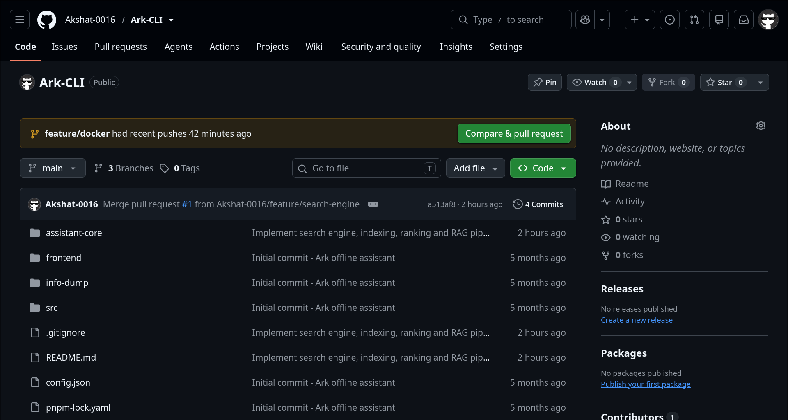
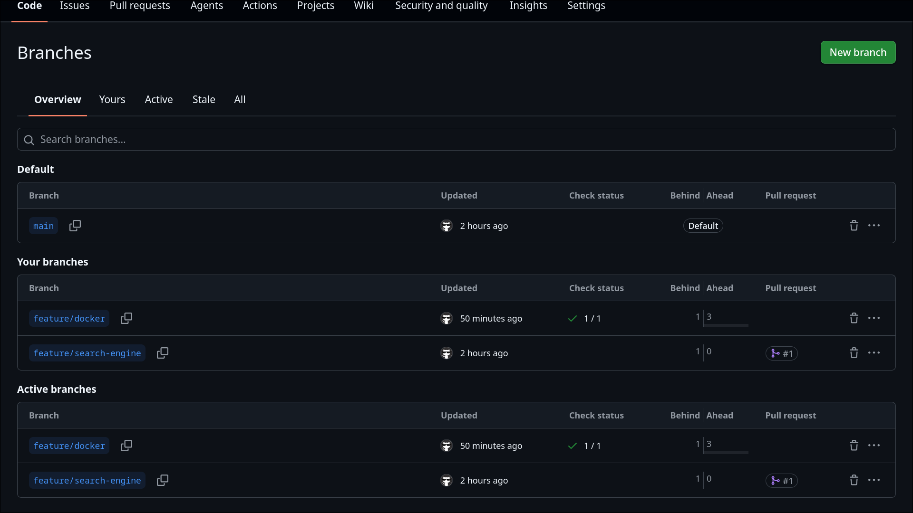
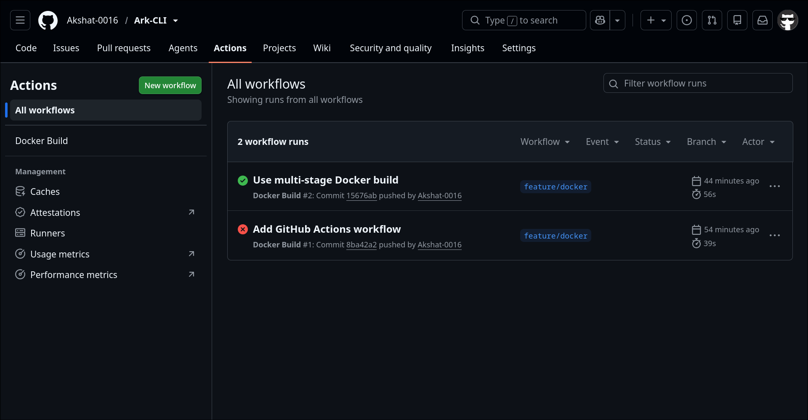
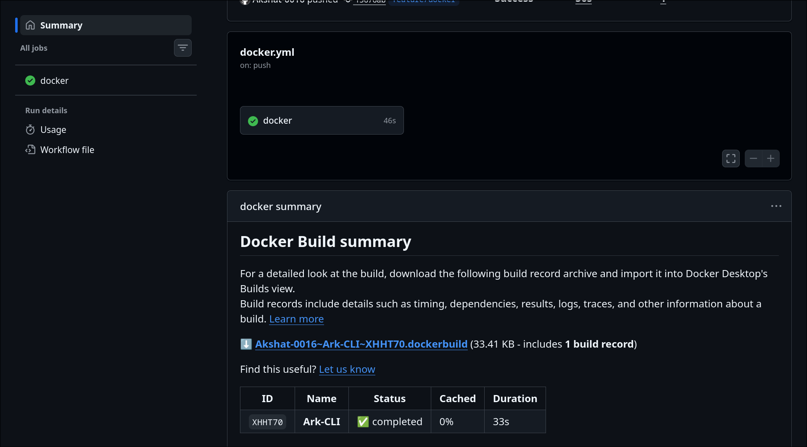
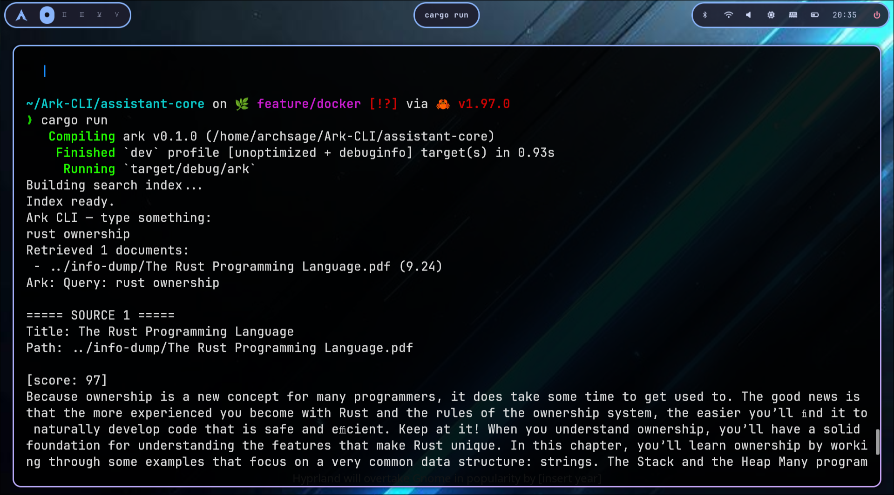
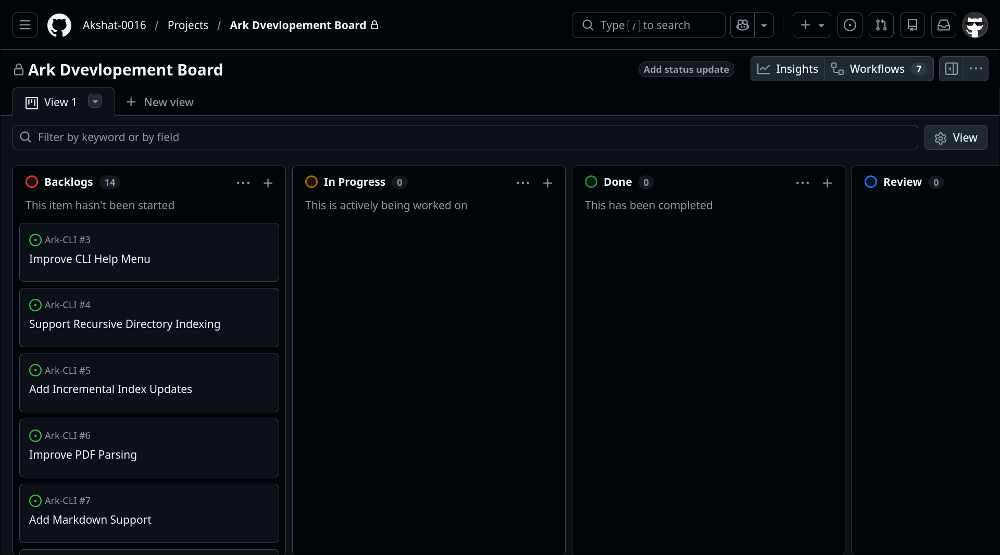

# Ark CLI

> A fast, offline-first intelligent document retrieval assistant built in Rust.

---

# Vision Document

## Project Overview

Ark CLI is a local-first command-line intelligent assistant designed to retrieve information from personal documents quickly and accurately. Unlike cloud-based AI assistants that depend on external APIs or internet connectivity, Ark operates entirely on the user's machine, providing secure, private, and efficient document search.

Ark combines modern Information Retrieval techniques such as inverted indexing, BM25 ranking, natural language preprocessing, and Retrieval-Augmented Generation (RAG) to help users search through PDFs, notes, and text documents using natural language queries.

The project is intended to become a lightweight productivity tool that respects user privacy while delivering fast and relevant search results.

---

# Problem Statement

Modern AI assistants often require:

- Continuous internet connectivity
- Cloud-hosted large language models
- Uploading private documents to external servers
- Expensive API subscriptions
- High hardware requirements

These limitations make them unsuitable for users who prioritize privacy, offline accessibility, and lightweight deployment.

Searching through hundreds of PDFs manually is slow and inefficient. Traditional keyword search also struggles with understanding natural language queries and ranking results by relevance.

Ark CLI addresses these challenges by providing an offline search engine capable of intelligently indexing and retrieving relevant information from local documents.

---

# Vision Statement

> To build a lightweight, privacy-focused, offline intelligent assistant capable of retrieving knowledge from personal documents using modern information retrieval techniques without relying on cloud-based AI services.

---

# Target Users

## Student

### Goals

- Search lecture notes instantly
- Find concepts inside PDFs
- Retrieve definitions quickly
- Prepare for examinations

### Pain Points

- Hundreds of lecture PDFs
- Difficult manual searching
- Slow document navigation

---

## Researcher

### Goals

- Search research papers
- Compare multiple documents
- Locate references efficiently
- Reduce literature review time

### Pain Points

- Large collections of PDFs
- Difficult keyword matching
- Time-consuming manual reading

---

## Software Developer

### Goals

- Search documentation
- Find configuration examples
- Locate code snippets
- Organize technical notes

### Pain Points

- Large documentation folders
- Numerous Markdown notes
- Multiple project references

---

## Privacy-Conscious User

### Goals

- Keep all documents local
- Avoid cloud AI services
- Maintain complete ownership of data

### Pain Points

- Privacy concerns
- Internet dependency
- Subscription costs

---

# Objectives

The primary objectives of Ark CLI are:

- Build a fully offline document retrieval system.
- Provide fast search using inverted indexing.
- Rank results using the BM25 algorithm.
- Process natural language queries using an NLP pipeline.
- Generate concise summaries using Retrieval-Augmented Generation.
- Maintain complete user privacy.
- Offer a lightweight and responsive command-line interface.
- Ensure cross-platform compatibility through Docker.

---

# Key Features

## Document Indexing

- Automatic indexing of local documents
- Efficient inverted index construction
- Fast retrieval
- Incremental indexing support

---

## Intelligent Search

- Natural language query processing
- Tokenization
- Stop-word removal
- Text normalization
- BM25 relevance ranking

---

## Retrieval-Augmented Generation

Instead of generating responses from memorized knowledge, Ark retrieves relevant document sections before producing answers.

This improves:

- Accuracy
- Explainability
- Relevance

---

## Natural Language Processing

Ark includes its own NLP pipeline consisting of:

- Tokenizer
- Normalizer
- Stop-word remover
- Sentence splitter
- PDF text normalizer

---

## Privacy First

All processing occurs locally.

No files are uploaded.

No external APIs are required.

No internet connection is necessary.

---

## Docker Support

Ark supports containerized development using Docker.

Benefits include:

- Consistent development environments
- Easy deployment
- Platform independence
- Simplified setup

---

## GitHub Actions

Continuous Integration automatically verifies that the project builds successfully whenever code is pushed to the repository.

---

# Success Metrics

The project will be considered successful if it satisfies the following goals:

- Search results are returned within one second for typical document collections.
- Relevant documents consistently appear near the top of search results.
- The application operates completely offline.
- Docker images build successfully using GitHub Actions.
- Users can set up the project within a few minutes using the provided documentation.
- The indexing pipeline supports large collections of PDFs and text files efficiently.

---

# Assumptions

The following assumptions were made during development:

- Documents are stored locally.
- Users prefer privacy over cloud-based AI.
- Document collections primarily contain English text.
- The local machine has sufficient storage for indexing.
- Rust provides the necessary performance for document retrieval.

---

# Constraints

Current project limitations include:

- Command-line interface only.
- English language support.
- Local document storage.
- PDF and text document focus.
- Single-user environment.
- No cloud synchronization.

---

# Technology Stack

| Layer                | Technology            |
| -------------------- | --------------------- |
| Programming Language | Rust                  |
| Search Engine        | Custom Inverted Index |
| Ranking Algorithm    | BM25                  |
| NLP                  | Custom Rust Pipeline  |
| Containerization     | Docker                |
| CI/CD                | GitHub Actions        |
| Version Control      | Git                   |
| Repository Hosting   | GitHub                |
| Documentation        | Markdown              |

---

# High-Level Workflow

```
User Query
     │
     ▼
CLI Parser
     │
     ▼
Query Processing
     │
     ▼
Tokenizer
     │
     ▼
Normalizer
     │
     ▼
Search Engine
     │
     ▼
BM25 Ranking
     │
     ▼
Document Retrieval
     │
     ▼
Chunk Ranking
     │
     ▼
Response Generation
     │
     ▼
Terminal Output
```

---

# Repository Structure

```
Ark-CLI/

├── assistant-core/
│   ├── src/
│   ├── tests/
│   └── Cargo.toml
│
├── frontend/
│
├── info-dump/
│
├── .github/
│   └── workflows/
│
├── Dockerfile
├── docker-compose.yml
├── .dockerignore
├── README.md
└── LICENSE
```

---

# Branching Strategy

Ark CLI follows the **GitHub Flow** branching model.

The `main` branch always contains stable and production-ready code. All new features are developed in dedicated feature branches. Once development is complete, a Pull Request is created and reviewed before merging into the main branch.

```
main
│
├── feature/search-engine
│
├── feature/docker
│
├── feature/indexer
│
└── feature/parser
```

### Workflow

1. Create a feature branch from `main`.
2. Develop the feature independently.
3. Commit changes with meaningful commit messages.
4. Push the branch to GitHub.
5. Open a Pull Request.
6. Review changes.
7. Merge into `main`.
8. Delete the feature branch.

### Advantages

- Stable main branch
- Easier collaboration
- Isolated feature development
- Better code reviews
- Simplified version control

---

# Local Development Setup

## Prerequisites

Install the following software before running Ark CLI.

| Software         | Version            |
| ---------------- | ------------------ |
| Rust             | Latest Stable      |
| Cargo            | Included with Rust |
| Git              | Latest             |
| Docker           | Latest             |
| Docker Compose   | Latest             |
| VS Code / Cursor | Recommended        |

---

## Clone Repository

```bash
git clone https://github.com/Akshat-0016/Ark-CLI.git

cd Ark-CLI
```

---

## Build Project

```bash
cargo build --release
```

---

## Run Project

```bash
cargo run
```

---

## Run Tests

```bash
cargo test
```

---

# Docker

Docker is used to provide a reproducible development environment.

The project uses a **multi-stage Docker build**.

Advantages include:

- Smaller final image
- Faster deployments
- Clean separation between build and runtime
- Platform-independent execution

---

## Build Docker Image

```bash
docker build -t ark .
```

---

## Run Docker Container

```bash
docker run -it ark
```

---

## Docker Compose

```bash
docker compose up
```

Docker Compose simplifies local development by automatically creating and running the required containers.

---

# Continuous Integration

GitHub Actions is used for Continuous Integration (CI).

Whenever changes are pushed to GitHub, the workflow automatically:

- Checks out the repository
- Sets up Docker Buildx
- Builds the Docker image
- Reports success or failure

This ensures that Docker configuration remains valid throughout development.

---

# Quick Start – Local Development

### Step 1

Clone the repository.

```bash
git clone https://github.com/Akshat-0016/Ark-CLI.git
```

---

### Step 2

Navigate into the repository.

```bash
cd Ark-CLI
```

---

### Step 3

Build the application.

```bash
cargo build
```

---

### Step 4

Run the application.

```bash
cargo run
```

---

### Step 5

(Optional)

Run using Docker.

```bash
docker build -t ark .

docker run -it ark
```

---

# Development Tools

The following tools were used during development.

| Tool             | Purpose                 |
| ---------------- | ----------------------- |
| Rust             | Core application        |
| Cargo            | Package management      |
| Git              | Version control         |
| GitHub           | Repository hosting      |
| Docker           | Containerization        |
| GitHub Actions   | Continuous Integration  |
| VS Code / Cursor | Development environment |
| Draw.io          | Architecture diagrams   |
| Figma            | Wireframe design        |
| Markdown         | Documentation           |

---

# Project Highlights

- Offline-first architecture
- Privacy-focused design
- Custom search engine
- BM25 ranking
- Retrieval-Augmented Generation
- Modular NLP pipeline
- Docker support
- GitHub Actions CI
- GitHub Flow workflow
- Cross-platform compatibility

---

# Future Scope

The following features are planned for future releases.

## Artificial Intelligence

- Local language model integration
- Context-aware responses
- Better summarization
- Question answering

---

## Search Improvements

- Semantic search
- Hybrid search
- Vector embeddings
- Knowledge graph integration

---

## User Experience

- Desktop application
- Web interface
- Mobile companion
- Interactive search

---

## Performance

- Parallel indexing
- Incremental indexing
- Memory optimization
- Faster ranking algorithms

---

# Contributing

Contributions are welcome.

To contribute:

1. Fork the repository.
2. Create a feature branch.
3. Commit your changes.
4. Push the branch.
5. Open a Pull Request.

Please ensure all code builds successfully before submitting a Pull Request.

---

# License

This project is licensed under the MIT License.

---

# Author

**Akshat**

**24BAI1222**
B.Tech Computer Science Engineering

Rust Developer | AI Enthusiast | Systems Programming

GitHub:
https://github.com/Akshat-0016

---

# Acknowledgements

Special thanks to the Rust community and the open-source ecosystem for providing excellent tools and libraries that made this project possible.

---

# Project Status

Current Version: **Prototype**

Status:

- ✅ Search Engine
- ✅ Inverted Index
- ✅ BM25 Ranking
- ✅ NLP Pipeline
- ✅ RAG Retrieval
- ✅ GitHub Flow
- ✅ Docker
- ✅ GitHub Actions
- 🚧 Desktop GUI (Planned)
- 🚧 Local LLM Integration (Planned)

---

# Screenshots

## Repository

_

---

## Feature Branches



---

## Docker Build



---

## Docker Run



---

## Application Running



---

## Project Board



---

# Repository

https://github.com/Akshat-0016/Ark-CLI
